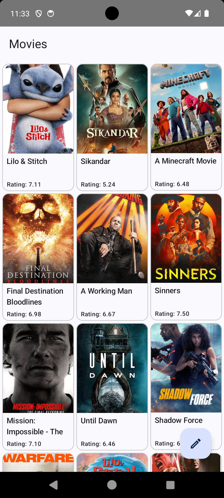

# Android Clean Architecture App

A modular Android application built with Kotlin, Jetpack Compose, and a clean architecture approach. The project uses modern libraries like Ktor, Koin, Coroutines, and follows principles such as Inversion of Control and a unidirectional data flow (MVI-inspired) in the presentation layer.

|  |  |  |
|-----------------|-----------------|-----------------|

---

## 🧱 Architecture Overview

This project is organized into **5 layers** with clear separation of concerns:

```
ui           # Jetpack Compose UI + Navigation
presentation # ViewModels, MVI-esque state handling
domain       # UseCases, domain models, and data layer definitions
data         # Services, network layer definitions
network      # DTO models, Api and Http client
```

### Key Principles:
- **Clean Architecture**: Domain layer is independent of any framework or platform
- **Dependency Inversion**: Interfaces for outer layers are defined within and implemented outside
- **MVI-ish Pattern**: Unidirectional flow in the presentation layer

---

## 📦 Tech Stack

| Area              | Tool / Library |
|-------------------|----------------|
| UI                | Jetpack Compose, Material 3 |
| Navigation        | Jetpack Navigation Compose |
| DI                | Koin |
| Networking        | Ktor Client |
| JSON Serialization | Kotlinx Serialization |
| Image Loading     | Coil |
| Async             | Kotlin Coroutines |
| Time              | kotlinx-datetime |
| Testing           | Kotlin Test, MockK, Turbine, Coroutine Test |

---

## 🚀 Build & Run

### Requirements
- **Android Studio Koala (2024.1+)**
- **Kotlin 1.9.0**
- **Android SDK 34**
- **Minimum SDK: 24**

## 🧪 Testing

This project includes unit tests for the presentation layer.

To run tests:

```bash
./gradlew test
```

Test tools used:
- **MockK** for mocking
- **kotlinx-coroutines-test** for coroutine testing
- **Turbine** for testing Flow streams
